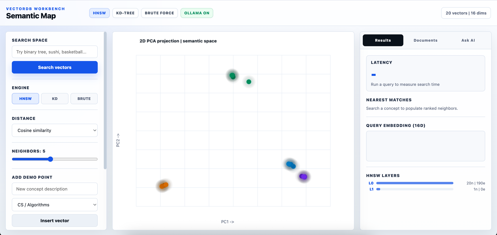
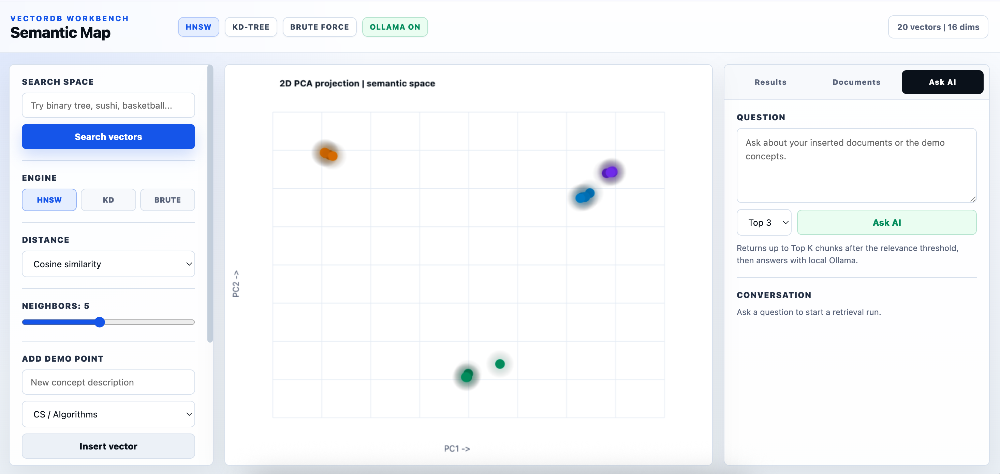

# RAG Visualizer

RAG Visualizer is an interactive JavaScript application that demonstrates how modern Retrieval-Augmented Generation (RAG) systems work. It includes a custom Vector Database implementation with HNSW, KD-Tree, and Brute Force search algorithms, allowing users to visualize vector similarity search, benchmark retrieval performance, and explore nearest-neighbor indexing techniques.

The project integrates with Ollama to generate embeddings, index documents, perform semantic search, and answer questions using retrieved context. It serves as both a learning tool for vector databases and a practical demonstration of how AI-powered retrieval systems operate behind the scenes.

## Home Screen

## Search Visualization

 